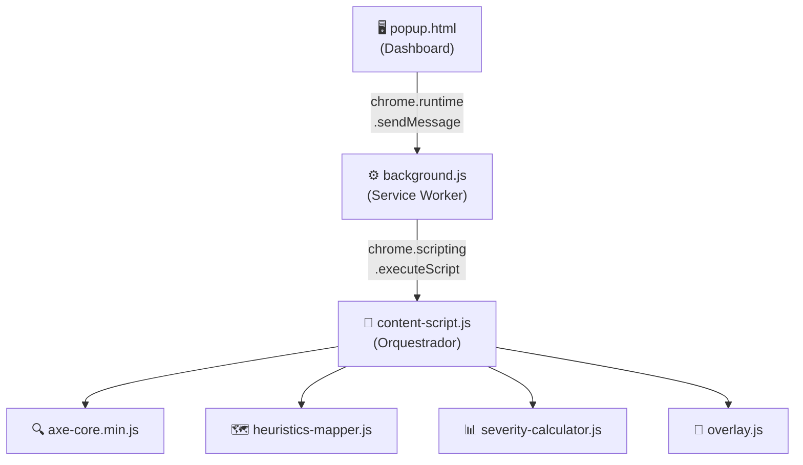

<p align="center">
  
</p>

<h1 align="center">HeuriLens - Heuristic Accessibility and Usability Auditor</h1>

<p align="center">
  <strong>Extensão Chrome (Manifest V3) para auditoria automática de acessibilidade (WCAG 2.1) e usabilidade (Heurísticas de Nielsen).</strong>
</p>

<p align="center">
  
  
  
  
  
</p>

---

## 📋 Sobre

O **HeuriLens** é uma extensão do Google Chrome que realiza auditorias automáticas em páginas web, combinando duas perspectivas complementares:

- **Acessibilidade técnica** — baseada nos critérios da [WCAG 2.1](https://www.w3.org/TR/WCAG21/) (nível A e AA)
- **Usabilidade** — baseada nas [10 Heurísticas de Usabilidade de Jakob Nielsen](https://www.nngroup.com/articles/ten-usability-heuristics/)

A extensão utiliza o motor de análise **[axe-core](https://github.com/dequelabs/axe-core)** para detectar falhas técnicas no DOM e, em seguida, mapeia cada violação para a heurística de Nielsen correspondente, gerando uma visão unificada de acessibilidade e usabilidade.

> **Contexto DSR (Design Science Research):** Este artefato foi projetado para ser escalável e integrável em pipelines de CI/CD futuros, através da exportação de relatórios em formato JSON compatível com o padrão Lighthouse.

---

## 🏗️ Arquitetura



### Fluxo de Funcionamento

1. O usuário clica em **"Analisar Página"** no popup
2. O `background.js` injeta os scripts de análise na aba ativa
3. O `content-script.js` executa o axe-core contra o DOM
4. Os resultados são processados pelo **mapeador de heurísticas** e pelo **calculador de severidade**
5. O **overlay visual** é renderizado sobre os elementos problemáticos
6. Os resultados são enviados de volta ao popup para exibição no **dashboard**

---

## 📁 Estrutura do Projeto

```
heuristic-extension/
├── manifest.json                # Manifest V3 — configuração da extensão
├── background.js                # Service Worker — injeção, comunicação, storage
├── content/
│   ├── content-script.js        # Orquestrador principal da auditoria
│   ├── heuristics-mapper.js     # Mapeamento de regras axe-core → Heurísticas de Nielsen
│   ├── severity-calculator.js   # Classificação de severidade (4 níveis)
│   ├── overlay.js               # Badges circulares com ícones sobre os elementos
│   └── panel.js                 # Painel flutuante reposicionável (drag & drop)
├── popup/
│   ├── popup.html               # Interface do dashboard + guia de legendas
│   ├── popup.css                # Estilos premium (dark mode, glassmorphism)
│   └── popup.js                 # Lógica do popup, legendas e renderização
├── lib/
│   └── axe-core.min.js          # Biblioteca axe-core v4.10.2
├── icons/
│   ├── logo.svg                 # Logo vetorial original
│   ├── icon16.png               # Ícone 16x16
│   ├── icon32.png               # Ícone 32x32
│   ├── icon48.png               # Ícone 48x48
│   └── icon128.png              # Ícone 128x128
└── assets/
    └── overlay-icons.css        # Estilos dos badges e tooltips do overlay
```

---

## ✨ Funcionalidades

### 1. 🔍 Motor de Análise (axe-core)

- Execução configurada para **WCAG 2.1 nível A e AA**
- Análise completa do DOM da página ativa
- Categorias verificadas: semântica, formulários, teclado, cor, ARIA, linguagem, alternativas de texto, tabelas, e mais

### 2. 🗺️ Mapeamento de Heurísticas de Nielsen

Aproximadamente **100 regras** do axe-core mapeadas para as 10 Heurísticas:

| # | Heurística de Nielsen | Exemplos de Regras axe-core |
|:---:|---|---|
| H1 | **Visibilidade do Status do Sistema** | `aria-live-region`, `status-messages` |
| H2 | **Correspondência com o Mundo Real** | `document-title`, `html-has-lang`, `link-name` |
| H3 | **Controle e Liberdade do Usuário** | `tabindex`, `focusable-content`, `no-autofocus` |
| H4 | **Consistência e Padrões** | `heading-order`, `landmark-*`, `region` |
| H5 | **Prevenção de Erros** | `autocomplete-valid`, `label`, `select-name` |
| H6 | **Reconhecimento em vez de Recordação** | `button-name`, `aria-label`, `td-has-header` |
| H7 | **Flexibilidade e Eficiência de Uso** | `bypass`, `skip-link`, `target-size` |
| H8 | **Design Estético e Minimalista** | `color-contrast`, `empty-heading`, `marquee` |
| H9 | **Reconhecimento e Recuperação de Erros** | `aria-required-*`, `aria-valid-attr`, `nested-interactive` |
| H10 | **Ajuda e Documentação** | `image-alt`, `frame-title`, `video-caption` |

> Regras não mapeadas diretamente utilizam um **fallback inteligente** baseado nas tags WCAG (Perceivable → H8, Operable → H3, Understandable → H2, Robust → H9).

### 3. 📊 Classificação de Severidade

Os defeitos são categorizados em **4 níveis** baseados em um algoritmo que combina:

| Fator | Descrição |
|---|---|
| **Impacto axe-core** | `critical` (4), `serious` (3), `moderate` (2), `minor` (1) |
| **Frequência** | Bônus para erros com muitas instâncias (≥3, ≥5, ≥10) |
| **Contexto crítico** | Peso extra para erros em `<form>`, `<nav>`, `<dialog>`, `<button>`, etc |

| Nível | Score | Descrição |
|:---:|:---:|---|
| 🔴 **Crítico** | ≥ 4.0 | Impede o uso por pessoas com deficiência |
| 🟠 **Sério** | ≥ 3.0 | Causa dificuldade significativa |
| 🟡 **Moderado** | ≥ 2.0 | Causa alguma dificuldade |
| 🔵 **Menor** | < 2.0 | Impacto baixo, melhoria recomendada |

### 4. 🖥️ Interface do Usuário (Popup)

Dashboard premium com **dark mode** e **glassmorphism**:

- **4 cards** de contagem por severidade com animação
- **Lista colapsível** de problemas agrupados por heurística
- **Estatísticas** de testes aprovados e não aplicáveis
- **3 estados visuais**: idle → analisando → resultados (+ estado de erro)

### 5. 🎯 Overlay Visual

Badges circulares com ícones SVG diferenciados por tipo de problema, injetados sobre os elementos:

- Posicionamento via `getBoundingClientRect()`
- **20 ícones SVG distintos** por categoria (imagem, contraste, label, heading, link, ARIA, etc.)
- **Badges circulares** coloridos por severidade (🔴🟠🟡🔵)
- **Tooltips** detalhados ao hover (descrição, heurística, WCAG, instâncias)
- **Highlight** do elemento com contorno ao passar o mouse
- **Reposicionamento automático** em scroll e resize
- **Animação de pulse** para chamar atenção

### 6. 🔲 Painel Flutuante Reposicionável

- **Drag & drop** — arraste livremente pela tela
- **Minimizar/fechar** — controles no cabeçalho
- **Guia de Legendas** integrado (botão ?) com WCAG, severidade, ícones e heurísticas
- **Persistência de posição** via `localStorage`
- Dashboard completo com reanálise, overlay e exportação JSON

### 7. ❓ Guia de Legendas

Acessível tanto no popup quanto no painel flutuante:

- **Níveis WCAG** — A (essencial), AA (recomendado), AAA (ideal)
- **Severidade** — Crítico, Sério, Moderado, Menor com descrição de impacto
- **Ícones** — Grid visual com todos os 20 tipos de problema da extensão
- **Heurísticas de Nielsen** — H1 a H10 com nome e descrição

### 8. 📄 Exportação JSON (formato Lighthouse)

Relatório completo em JSON contendo:

```json
{
  "meta": {
    "toolName": "HeuriLens",
    "version": "1.0.0",
    "timestamp": "2026-02-10T22:15:00.000Z",
    "url": "https://example.com",
    "title": "Página Exemplo"
  },
  "summary": {
    "totalIssues": 12,
    "bySeverity": { "critical": 2, "serious": 4, "moderate": 3, "minor": 3 },
    "byHeuristic": { "H8": 3, "H10": 4, "H5": 2, "..." : "..." }
  },
  "issues": [
    {
      "id": "color-contrast",
      "description": "Elementos devem ter contraste de cor suficiente",
      "wcagCriteria": ["1.4.3"],
      "wcagLevel": "AA",
      "nielsenHeuristic": {
        "id": "H8",
        "name": "Design Estético e Minimalista"
      },
      "severity": {
        "level": "serious",
        "score": 3,
        "impact": "serious",
        "frequency": 5
      },
      "nodes": [
        {
          "html": "<p style='color: #aaa'>Texto com baixo contraste</p>",
          "target": ["p:nth-child(3)"],
          "failureSummary": "Fix any of the following: ..."
        }
      ]
    }
  ]
}
```

---

## 🚀 Instalação e Uso

### Pré-requisitos

- Google Chrome (versão 88+)

### Instalação (modo desenvolvedor)

1. Clone este repositório:
   ```bash
   git clone https://github.com/FelipeMeloF/heuristic-extension.git
   ```

2. Abra o Chrome e navegue até:
   ```
   chrome://extensions/
   ```

3. Ative o **Modo do desenvolvedor** (toggle no canto superior direito)

4. Clique em **"Carregar sem compactação"**

5. Selecione a pasta `heuristic-extension/`

### Como usar

1. Navegue até a página que deseja auditar
2. Clique no ícone da extensão na barra de ferramentas
3. Clique no botão **"Analisar Página"**
4. Visualize os resultados no **dashboard**
5. Observe os **badges visuais** sobre os elementos com problemas
6. Use **"Exportar JSON"** para salvar o relatório completo

---

## 🔧 Detalhes Técnicos

### Permissões

| Permissão | Uso |
|---|---|
| `activeTab` | Acesso à aba ativa para injeção de scripts |
| `scripting` | Injeção de content scripts via `chrome.scripting` |
| `storage` | Armazenamento local dos resultados da última auditoria |

### Tecnologias

- **Manifest V3** — padrão atual do Chrome Extensions
- **axe-core v4.10.2** — motor de acessibilidade da Deque Systems
- **Vanilla JS/CSS** — sem dependências de frameworks
- **CSS Glassmorphism** — design moderno com backdrop-filter

### Escalabilidade para CI/CD

O relatório JSON exportado segue um formato compatível com integrações de CI/CD:

```bash
# Exemplo de uso futuro em pipeline
node audit-cli.js --url https://example.com --output report.json
# Verificar se há defeitos críticos
node check-thresholds.js --report report.json --max-critical 0
```

---

## 📜 Licença

Este projeto está sob a licença [MIT](LICENSE).

---

<p align="center">
  Feito com 💜 para promover a <strong>acessibilidade web</strong>
</p>
